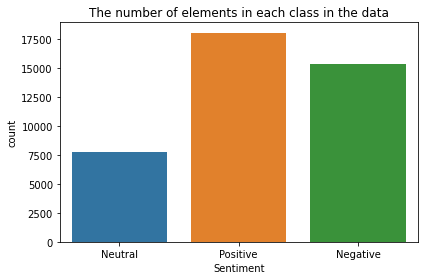
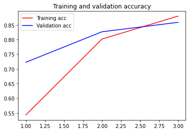
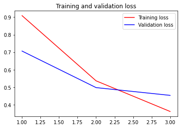

# Covid-19 Sentiment Analysis using LSTM

**Description:** 
Sentiment analysis is one application of text classification. This project is about deciding whether a text is positive, neutral, or negative. The process model is implemented in a Python script that using LSTM model.


## Load the Data Set

In this article, we’ll use the [Coronavirus tweets](https://www.kaggle.com/datatattle/covid-19-nlp-text-classification) available from the Kaggle datasets. This data set contains text labeled with extremely positive, positive, neutral, negatif, and extremely negative. In this article, we will reduce the label into positive, neutral, or negative only. The extremely positive label will go to positive and the extremely negative label will go to negative. The dataset contains a total of 41157 text corresponding to the 'Negative' (15398 text), 'Neutral' (7713 text) and 'Scissors' (18046 text) tweets. 




## Data Cleaning

The code below shows the data cleaning process for each sample in the dataset. It includes removing the special characters, digits, unnecessary symbols, and stopwords. Also, it is required to convert the words to their root form for easy interpretation.

```py
def remove_punctuation(s):
    list_punctuation = list(punctuation)
    for i in list_punctuation:
        s = s.replace(i,'')
    return s.lower()

def clean_sentence(sentence):
    sentence = sentence.lower()
    sentence = re.sub(r'(\W)\1{2,}', r'\1', sentence) 
    sentence = re.sub(r'(\w)\1{2,}', r'\1\1', sentence)
    sentence = re.sub(r'(?P<url>https?://[^\s]+)', '', sentence)
    sentence = re.sub(r"\@(\w+)", '', sentence) 
    sentence = re.sub(r"\#(\w+)", '', sentence) 
    sentence = re.sub(r"\$(\w+)", '', sentence) 
    sentence= re.sub(r'[^\w]', ' ', sentence)
    sentence= re.sub(r"[&amp]", '', sentence)
    sentence = sentence.replace("-",' ')
    tokens = sentence.split()
    tokens = [remove_punctuation(w) for w in tokens] 
    stop_words = set(stopwords.words('english')) 
    tokens = [w for w in tokens if not w in stop_words]
    remove_digits = str.maketrans('', '', digits)
    tokens = [w.translate(remove_digits) for w in tokens]
    tokens = [w.strip() for w in tokens]
    tokens = [w for w in tokens if w!=""]
    tokens = ' '.join(tokens)
    return tokens
```


## Visualizing the Common Words

To find commonly used words in tweets, we use the worldcould function. This allows us to see the most frequent word of all the tweets. The size of each word represents its frequency of occurrence in the data.

```py
allWords = ''.join([twts for twts in df_new['OriginalTweet']])
wordCloud = WordCloud(width = 300,height =150,random_state = 21,max_font_size =119).generate(allWords)
plt.imshow(wordCloud,interpolation = "bilinear")
plt.axis('off')
plt.show()
```

The output shows that the most frquent words are covid, grocery, and store.


## Lemmatizating the dataset

Lemmatization is the process of converting a word to its base form. The difference between stemming and lemmatization is, lemmatization considers the context and converts the word to its meaningful base form, whereas stemming just removes the last few characters, often leading to incorrect meanings and spelling errors.[*](https://www.machinelearningplus.com/nlp/lemmatization-examples-python/)

```py
lemmatizer = WordNetLemmatizer()
def nltk_tag_to_wordnet_tag(nltk_tag):
    if nltk_tag.startswith('J'):
        return wordnet.ADJ
    elif nltk_tag.startswith('V'):
        return wordnet.VERB
    elif nltk_tag.startswith('N'):
        return wordnet.NOUN
    elif nltk_tag.startswith('R'):
        return wordnet.ADV
    else:
        return None

def lemmatize_sentence(de_punct_sent):
    nltk_tagged = nltk.pos_tag(nltk.word_tokenize(de_punct_sent))
    wordnet_tagged = map(lambda x: (x[0], nltk_tag_to_wordnet_tag(x[1])), nltk_tagged)
    lemmatized_sentence = []
    for word, tag in wordnet_tagged:
        if tag is None:
            lemmatized_sentence.append(word)
        else:
            lemmatized_sentence.append(lemmatizer.lemmatize(word, tag))
    return " ".join(lemmatized_sentence)
```


## Tokenizing and converting the reviews into numerical vectors.

Tokenization used to make the interpretation of the text easier. Tokenization is essentially splitting a phrase, sentence, paragraph, or an entire text document into smaller units, such as individual words or terms. Each of these smaller units are called tokens.

```py
tokenizer = Tokenizer(num_words=10000, oov_token='x')
tokenizer.fit_on_texts(df_baru['OriginalTweet'].values)
df_token = tokenizer.texts_to_sequences(df_baru['OriginalTweet'].values)
word_index = tokenizer.word_index
maxlen = 40
df_train = pad_sequences(df_token, maxlen=maxlen, padding='post', truncating='post') 
```


## Building the LSTM model using the ‘Keras’ library

After the dataset is ready to use, build the long short term memory model using keras library.

```py
model = tf.keras.Sequential([
    tf.keras.layers.Embedding(input_dim=25000, output_dim=16),
    tf.keras.layers.LSTM(128, dropout=0.2, recurrent_dropout=0.2),
    tf.keras.layers.Dense(256, activation='relu'),
    tf.keras.layers.Dense(128, activation='relu'),
    tf.keras.layers.Dense(64, activation='relu'),
    tf.keras.layers.Dense(3, activation='softmax')
])
model.compile(loss='categorical_crossentropy', optimizer=keras.optimizers.Adam(learning_rate=0.001), metrics=['accuracy'])
```

## Define Callback

Too many epochs can lead to overfitting of the training dataset, while too few can lead to model underfit. one way to prevent both is with early termination. this allows you to specify an arbitrary large number of training epochs and stop training once the model performance stops improving on a hold out validation dataset.[*](https://machinelearningmastery.com/how-to-stop-training-deep-neural-networks-at-the-right-time-using-early-stopping/)

```py
class Call(tf.keras.callbacks.Callback): 
  def on_epoch_end(self, epoch, logs={}): 
    if(logs.get('accuracy') > 0.85 and logs.get('val_accuracy') > 0.85):
      print("\nAccuracy > 85%") 
      self.model.stop_training = True 
 
callbacks = Call()
```
In this example, defined callback function stops after the accuracy of train and validation dataset greater than 85%.


## Splitting the data into training and testing data.

In this example, the data set were divided  with the 80/20 pattern. It's mean that 80% of instances chosen randomly is used for training a model and the other 20% for its validation. 

```py
label = df_new[['Negative',	'Neutral',	'Positive']].values
train_data, test_data, train_label, test_label = train_test_split(df_train, label, test_size = 0.2, random_state = 42)
```

## Trainig the Model

The training process displays the training and validation accuracy as well as the result of the callback function.

```
Epoch 1/10
1029/1029 - 99s - loss: 0.9087 - accuracy: 0.5427 - val_loss: 0.7065 - val_accuracy: 0.7224
Epoch 2/10
1029/1029 - 95s - loss: 0.5365 - accuracy: 0.8014 - val_loss: 0.4979 - val_accuracy: 0.8263
Epoch 3/10
1029/1029 - 95s - loss: 0.3616 - accuracy: 0.8797 - val_loss: 0.4535 - val_accuracy: 0.8585

Accuracy > 85%
```

Training and validation accuracy reached 85.85% after 3 epochs.


## Accuration and Loss Plot

Then accuration and loss plot is made to make it easier to understand the data training process.



From the accuracy plot we can see that the model has been trained well because the accuracy graphs are close to each other. We can also see that the accuracy of the model in the next epoch will be close to the final accuracy, so early termination is useful to prevent overfitting.



From the plot of loss, we can see that the model has comparable performance on both train and validation datasets. If these parallel plots start to depart consistently, it might be a sign to stop training at an earlier epoch.


# Thank you for your visit! Wanna see another project of me? 
# Back to [my Portfolio](https://firdaanindita.github.io/)!


